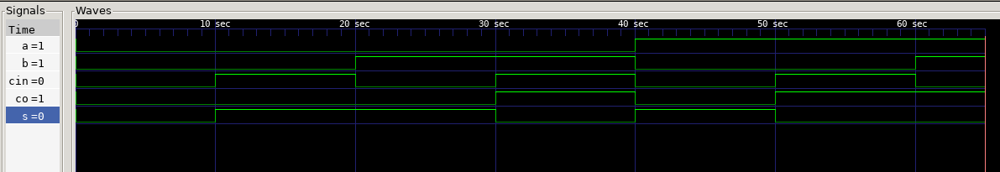
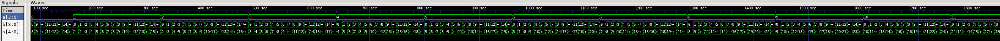

# Task 1: Full Adder
## Part 1.1: Derive the logic for a 1-bit adder
### Truth Table:
|   CI   |   B   |   A   |  CO   |   S   |
| ------ | ----- | ----- | ----- | ----- |
|   0    |   0   |   0   |   0   |   0   |
|   0    |   0   |   1   |   0   |   1   |
|   0    |   1   |   0   |   0   |   1   |
|   0    |   1   |   1   |   1   |   0   |
|   1    |   0   |   0   |   0   |   1   |
|   1    |   0   |   1   |   1   |   0   |
|   1    |   1   |   0   |   1   |   0   |
|   1    |   1   |   1   |   1   |   1   |

### Boolean Logic:

#### Carry Over Bit:

$ CO = A B \bar{CI} + A \bar{B} CI + \bar{A}B CI + A B CI $

$ CO = A B( CI + \bar{CI}) + \bar{A} B CI + A \bar{B} CI = A B + \bar{A} B CI + A \bar{B} CI$

$ = A(\bar{B} CI + B) + \bar{A} B CI = A (CI + B) + \bar{A} B CI $

$ = A CI + A B +\bar{A} B CI = A B + CI(\bar{A} B + A) $

$ = A B + CI (B + A) = A B + B CI + A CI $

#### Sum Bit:

$ S = A \bar{B CI} + \bar{A} B \bar{CI} + \bar{A B} CI + A B CI $

$ = A \oplus B \oplus CI $


## Part 1.2: Implement the 1-bit adder
```Verilog
module FullAdder(input a, input b, input ci, output s, output co);
    /*
    Implement a full adder using verilog
    */
    /*
    using data flow modeling
    assign s = a ^ b ^ ci;
    assign co = (a & b) | (b & ci) | (a & ci);
    */
    wire tempSum;
    wire foo;
    wire bar;
    wire baz;
    wire quux;


    xor(temp, a, b);
    xor(s, temp, ci);

    and(foo, a, b);
    and(bar, b, ci);
    and(baz, a, ci);
    or(quux, foo, bar);
    or(co, baz, quux);

endmodule
```
Used a testbench to test the values for each value of a, b, and ci with a #10 delay. Here is the GTKWave screenshot, and test.vcd is here if you want to use a waveform viewer.


## Part 1.3: Using the 1bit adder, implement a 4 bit adder
```Verilog
module FourBitAdder(input [3:0] a, input [3:0] b, output [4:0] s);
    /*
    implement a 4 bit adder using full adder from before
    */
    wire [2:0] c;
    FullAdder first(a[0], b[0], 0, s[0], c[0]);
    FullAdder second(a[1], b[1], c[0], s[1], c[1]);
    FullAdder third(a[2], b[2], c[1], s[2], c[2]);
    FullAdder fourth(a[3], b[3], c[2], s[3], s[4]);
    


endmodule
```
I created a testbench using a loop from 0 to 255 to assign the value to both inputs and used gtkwave to confirm that each value was correctly assigned. test_four.vcd is the filename for waveform simulation


# Task 2: 7 Segment

## Part 2.1: Convert a binary number to 7-segment display encoding
| Display |  S3  |  S2  | S1  |  S0  |   a  |  b  |  c  |  d  |  e  |  f  |  g  |
| ------- | ---- | ---- | --- | ---- | ---- | --- | --- | --- | --- | --- | --- |
|    0    |  0   |  0   |  0  |  0   |   0  |  0  |  0  |  0  |  0  |  0  |  1  |
|    1    |  0   |  0   |  0  |  1   |   1  |  0  |  0  |  1  |  1  |  1  |  0  |
|    2    |  0   |  0   |  1  |  0   |   0  |  0  |  1  |  0  |  0  |  1  |  0  |
|    3    |  0   |  0   |  1  |  1   |   0  |  0  |  0  |  0  |  1  |  1  |  0  |
|    4    |  0   |  1   |  0  |  0   |   1  |  0  |  0  |  1  |  1  |  0  |  0  |
|    5    |  0   |  1   |  0  |  1   |   0  |  1  |  0  |  0  |  1  |  0  |  0  |
|    6    |  0   |  1   |  1  |  0   |   0  |  1  |  0  |  0  |  0  |  0  |  0  |
|    7    |  0   |  1   |  1  |  1   |   0  |  0  |  0  |  1  |  1  |  1  |  1  |
|    8    |  1   |  0   |  0  |  0   |   0  |  0  |  0  |  0  |  0  |  0  |  0  |
|    9    |  1   |  0   |  0  |  1   |   0  |  0  |  0  |  0  |  1  |  0  |  0  |
|    A    |  1   |  0   |  1  |  0   |   0  |  0  |  0  |  1  |  0  |  0  |  0  |
|    B    |  1   |  0   |  1  |  1   |   1  |  1  |  0  |  0  |  0  |  0  |  0  |
|    C    |  1   |  1   |  0  |  0   |   0  |  1  |  1  |  0  |  0  |  0  |  1  |
|    D    |  1   |  1   |  0  |  1   |   1  |  0  |  0  |  0  |  0  |  1  |  0  |
|    E    |  1   |  1   |  1  |  0   |   0  |  1  |  1  |  0  |  0  |  0  |  0  |
|    F    |  1   |  1   |  1  |  1   |   0  |  1  |  1  |  1  |  0  |  0  |  0  |

## Part 2.2: 7-Segment Display
