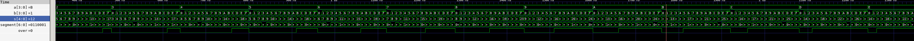
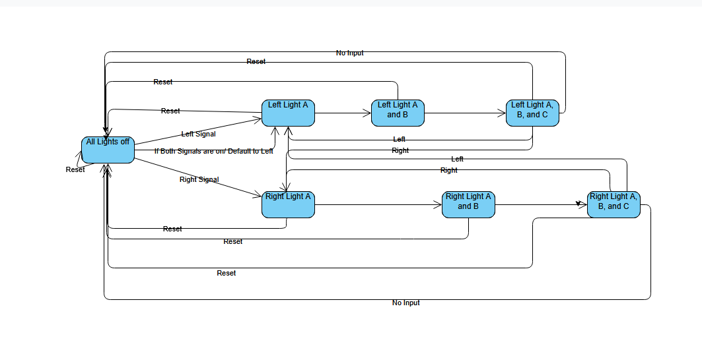
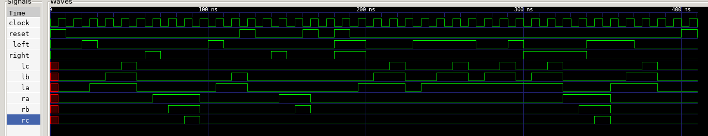

# Task 1: Full Adder
## Part 1.1: Derive the logic for a 1-bit adder
### Truth Table:

|   CI   |   B   |   A   |  CO   |   S   |
| ------ | ----- | ----- | ----- | ----- |
|   0    |   0   |   0   |   0   |   0   |
|   0    |   0   |   1   |   0   |   1   |
|   0    |   1   |   0   |   0   |   1   |
|   0    |   1   |   1   |   1   |   0   |
|   1    |   0   |   0   |   0   |   1   |
|   1    |   0   |   1   |   1   |   0   |
|   1    |   1   |   0   |   1   |   0   |
|   1    |   1   |   1   |   1   |   1   |

### Boolean Logic:

#### Carry Over Bit:

$ CO = A B \bar{CI} + A \bar{B} CI + \bar{A}B CI + A B CI $

$ CO = A B( CI + \bar{CI}) + \bar{A} B CI + A \bar{B} CI = A B + \bar{A} B CI + A \bar{B} CI$

$ = A(\bar{B} CI + B) + \bar{A} B CI = A (CI + B) + \bar{A} B CI $

$ = A CI + A B +\bar{A} B CI = A B + CI(\bar{A} B + A) $

$ = A B + CI (B + A) = A B + B CI + A CI $

#### Sum Bit:

$ S = A \bar{B CI} + \bar{A} B \bar{CI} + \bar{A B} CI + A B CI $

$ = A \oplus B \oplus CI $


## Part 1.2: Implement the 1-bit adder

```Verilog
module FullAdder(input a, input b, input ci, output s, output co);
    /*
    Implement a full adder using verilog
    */
    /*
    using data flow modeling
    assign s = a ^ b ^ ci;
    assign co = (a & b) | (b & ci) | (a & ci);
    */
    wire tempSum;
    wire foo;
    wire bar;
    wire baz;
    wire quux;


    xor(temp, a, b);
    xor(s, temp, ci);

    and(foo, a, b);
    and(bar, b, ci);
    and(baz, a, ci);
    or(quux, foo, bar);
    or(co, baz, quux);

endmodule
```
Used a testbench to test the values for each value of a, b, and ci with a #10 delay. Here is the GTKWave screenshot, and test.vcd is here if you want to use a waveform viewer.


## Part 1.3: Using the 1bit adder, implement a 4 bit adder

```Verilog
module FourBitAdder(input [3:0] a, input [3:0] b, output [4:0] s);
    /*
    implement a 4 bit adder using full adder from above
    */
    wire [2:0] c;
    FullAdder first(a[0], b[0], 1'b0, s[0], c[0]);
    FullAdder second(a[1], b[1], c[0], s[1], c[1]);
    FullAdder third(a[2], b[2], c[1], s[2], c[2]);
    FullAdder fourth(a[3], b[3], c[2], s[3], s[4]);
    


endmodule
```
I created a testbench using a loop from 0 to 255 to assign the value to both inputs and used gtkwave to confirm that each value was correctly assigned. test_four.vcd is the filename for waveform simulation


# Task 2: 7 Segment

## Part 2.1: Convert a binary number to 7-segment display encoding

| Display |  S3  |  S2  | S1  |  S0  |   a  |  b  |  c  |  d  |  e  |  f  |  g  |
| ------- | ---- | ---- | --- | ---- | ---- | --- | --- | --- | --- | --- | --- |
|    0    |  0   |  0   |  0  |  0   |   0  |  0  |  0  |  0  |  0  |  0  |  1  |
|    1    |  0   |  0   |  0  |  1   |   1  |  0  |  0  |  1  |  1  |  1  |  0  |
|    2    |  0   |  0   |  1  |  0   |   0  |  0  |  1  |  0  |  0  |  1  |  0  |
|    3    |  0   |  0   |  1  |  1   |   0  |  0  |  0  |  0  |  1  |  1  |  0  |
|    4    |  0   |  1   |  0  |  0   |   1  |  0  |  0  |  1  |  1  |  0  |  0  |
|    5    |  0   |  1   |  0  |  1   |   0  |  1  |  0  |  0  |  1  |  0  |  0  |
|    6    |  0   |  1   |  1  |  0   |   0  |  1  |  0  |  0  |  0  |  0  |  0  |
|    7    |  0   |  1   |  1  |  1   |   0  |  0  |  0  |  1  |  1  |  1  |  1  |
|    8    |  1   |  0   |  0  |  0   |   0  |  0  |  0  |  0  |  0  |  0  |  0  |
|    9    |  1   |  0   |  0  |  1   |   0  |  0  |  0  |  0  |  1  |  0  |  0  |
|    A    |  1   |  0   |  1  |  0   |   0  |  0  |  0  |  1  |  0  |  0  |  0  |
|    B    |  1   |  0   |  1  |  1   |   1  |  1  |  0  |  0  |  0  |  0  |  0  |
|    C    |  1   |  1   |  0  |  0   |   0  |  1  |  1  |  0  |  0  |  0  |  1  |
|    D    |  1   |  1   |  0  |  1   |   1  |  0  |  0  |  0  |  0  |  1  |  0  |
|    E    |  1   |  1   |  1  |  0   |   0  |  1  |  1  |  0  |  0  |  0  |  0  |
|    F    |  1   |  1   |  1  |  1   |   0  |  1  |  1  |  1  |  0  |  0  |  0  |

## Part 2.2: 7-Segment Display

```Verilog
module SevenSegment(input [3:0] a, input [3:0] b, output [6:0] d, output overflow);
    reg [6:0] d;
    wire [4:0] s;
    wire [3:0] lessSig;

    FourBitAdder add(a, b, s);
    assign overflow = s[4];
    assign lessSig = s[3:0];

    always @(lessSig) begin
        case (lessSig)
            0 : d = 7'b0000001;
            1 : d = 7'b1001110;
            2 : d = 7'b0010010;
            3 : d = 7'b0000110;
            4 : d = 7'b1001100;
            5 : d = 7'b0100100;
            6 : d = 7'b0100000;
            7 : d = 7'b0001111;
            8 : d = 7'b0000000;
            9 : d = 7'b0000100;
            10 : d = 7'b0001000;
            11 : d = 7'b1100000;
            12 : d = 7'b0110001;
            13 : d = 7'b1000010;
            14 : d = 7'b0110000;
            15 : d = 7'b0111000;
        endcase
    end

endmodule
```

Used a similar testbench to the FourBitAdder, with code in SevenSegment_tb.v where each value for the less significant digits are assigned to a binary according to the truth table above. Image for simulation below.



# Task 3: Finite State Machine
## Part 3.1: Design the FSM
### (i) Draw the State Diagram


### (ii) Draw a table describing the states to binary values
| state | binary value |
| ----- | ------------ |
| init  |     0000     |
|  RA   |     0001     |
|  RAB  |     0011     |
|  RABC |     0111     |
|  LA   |     1000     |
|  LAB  |     1100     |
|  LABC |     1110     |

### (iii) How to map binary state value to outputs
| state | binary value | Output signals |
| ----- | ------------ | -------------- |
| init  |     0000     |     000000     |
|  RA   |     0001     |     001000     |
|  RAB  |     0011     |     011000     |
|  RABC |     0111     |     111000     |
|  LA   |     1000     |     000100     |
|  LAB  |     1100     |     000110     |
|  LABC |     1110     |     000111     |

## Part 3.2: Implement the FSM
```Verilog
module TailLight(input rst, input clk, input l, input r, 
output reg lc, output reg lb, output reg la, 
output reg ra, output reg rb, output reg rc);
    
    reg [3:0] state, nextState;
    
    // various states
    parameter INIT = 4'b0000;
    parameter RA = 4'b0001;
    parameter RAB = 4'b0011;
    parameter RABC = 4'b0111;
    parameter LA = 4'b1000;
    parameter LAB = 4'b1100;
    parameter LABC = 4'b1110;

    // handle state register update on clock cycle
    always @ (posedge clk) begin
        if(rst)
            state <= INIT;
        else
            state <= nextState;
    end

    // next state logic
    always @(*) begin
        case(state)
            INIT:   nextState = l ? LA : r ? RA : INIT;
            RA:     nextState = RAB;
            RAB:    nextState = RABC;
            RABC:   nextState = l ? LA : r ? RA : INIT;
            LA:     nextState = LAB;
            LAB:    nextState = LABC;
            LABC:   nextState = l ? LA : r ? RA : INIT;
            default:nextState = INIT;
        endcase
    end

    // Output logic
    always @(*) begin
        case(state)
            INIT: begin
                lc <= 0;
                lb <= 0;
                la <= 0;
                ra <= 0;
                rb <= 0;
                rc <= 0;
            end
            RA: begin
                lc <= 0;
                lb <= 0;
                la <= 0;
                ra <= 1;
                rb <= 0;
                rc <= 0;
            end
            RAB: begin
                lc <= 0;
                lb <= 0;
                la <= 0;
                ra <= 1;
                rb <= 1;
                rc <= 0;
            end
            RABC: begin
                lc <= 0;
                lb <= 0;
                la <= 0;
                ra <= 1;
                rb <= 1;
                rc <= 1;
            end
            LA: begin
                lc <= 0;
                lb <= 0;
                la <= 1;
                ra <= 0;
                rb <= 0;
                rc <= 0;
            end
            LAB: begin
                lc <= 0;
                lb <= 1;
                la <= 1;
                ra <= 0;
                rb <= 0;
                rc <= 0;
            end
            LABC: begin
                lc <= 1;
                lb <= 1;
                la <= 1;
                ra <= 0;
                rb <= 0;
                rc <= 0;
            end
            default: begin
                lc <= 0;
                lb <= 0;
                la <= 0;
                ra <= 0;
                rb <= 0;
                rc <= 0;
            end
        endcase
    end

endmodule
```
I wrote a testbench that tests various cases, including reset in the middle of a cycle, both inputs being on at the same time, and if states can be consecutively swapped between each other. Below is a screenshot of GTKWave and the full code for the testbench is in TailLight_tb.v 
I was struggling initially to get the outputs driven in the TailLight.v, so I changed all the outputs to register types. I am still looking into how to do this with wires instead.
