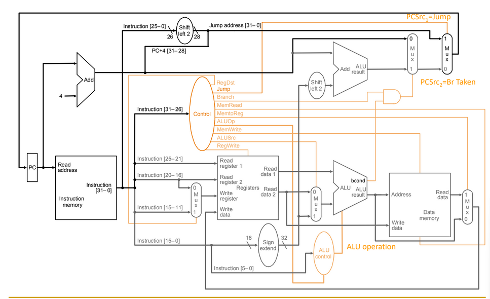

# Task 1: Arithmetic Logic and Data Movement Instructions
Implement a single-cycle processor with the following instructions:  
addi, sw, lw, add, and, andi, or, ori, nor, sll, srl, mul

I used this image of the Full Cycle Processor that we looked over in class, and created a module for ALU processing, register file, program memory, and a regular memory file. I then created separate modules for ADDI, ANDI, ORI along with a clock. Finally, I worked on a processor module that contains all of the logic. This turned into a large file that connects all of the others together, and I feel I should have named the variables better with a consistent naming scheme, but I ran out of time. The project doesn't currently work and I will be working on rebuilding it for the next homework. I believe you should be able to follow my thought process, but I still do not understand how to write this project in verilog. The only thing that requires a positive clock edge is incrementing the pc, but the rest of the logic is currently combinational.  
I will continue to work on this until the deadline, but if this is the last upload on Brightspace, you can assume that I was unsuccessful.

# Task 2: Control Flow Instructions
Augment your single-cycle processor from by implementing the following additional instructions:  
j, beq, bne, slt, jal, jr  
I have implemented these commands, but seeing as I can't get the first set of commands to work, I have not tested these at all.