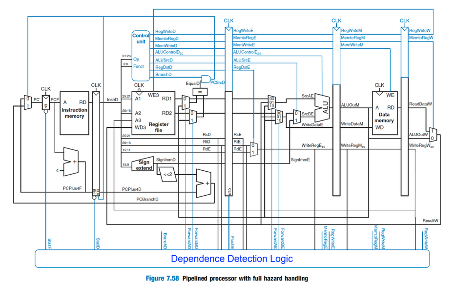

# Task 1: Develop a Five-Stage Pipelined MIPS Processor
Implement a five-stage pipeline following the canonical MIPS design with the following stages:
1. Instruction Fetch (IF)
2. Instruction Decode / Register Fetch (ID)
3. Execute (EX)
4. Memory Access (MEM)
5. Write Back (WB)

You may reuse and adapt your modules from the single-cycle processor (ALU, Control Unit, Register File, Memory, etc.), but modify the datapath and control logic to support pipelined execution.

## Implementation

### Pipeline Design Overview
I started with the standard 5-stage pipeline design we covered in class (shown below) as my foundation. This diagram was really helpful for understanding the basic datapath and where pipeline registers needed to go.



However, I made several modifications as I worked through the implementation:

**Key Additions:**
- **JAL/JR Support:** Added logic to detect jump instructions in the ID stage and calculate jump targets. JAL writes the return address to $ra, while JR reads from a register to determine where to jump.
- **Shift Instruction Handling:** SLL/SRL needed special treatment since the shift amount comes from the instruction's shamt field (bits 10:6) rather than from a register. I passed this through the immediate field and swapped the ALU inputs for shift operations.
- **Branch Logic:** Implemented branch decision making in the EX stage where the ALU result is checked against zero for BEQ instructions. The branch target is calculated as PC+1+offset.

## Pipeline Hazard Handling
- **Forwarding Unit:** Detects when data is needed from EX/MEM or MEM/WB stages and forwards it to avoid unnecessary stalls
- **Hazard Detection Unit:** Catches load-use hazards where an instruction immediately uses data being loaded from memory, inserting a 1-cycle stall
- **Pipeline Flushing:** When branches, jumps (JAL), or jump-registers (JR) are taken, the IF/ID register is flushed to prevent wrong instructions from executing

## Hazard Detection Comparison

With hazard detection enabled, the pipeline inserts stalls when RAW hazards are detected, ensuring correct results at the cost of performance. Without hazard detection, instructions execute without waiting, leading to faster execution but incorrect results when dependencies exist.

### Test 4 Results

| Register | With Hazard Detection | Without Hazard Detection |
|----------|----------------------|--------------------------|
| $t0 | 8 | 8 |
| $t1 | 15 | 15 |
| $t2 | 15 | **0** |
| $t3 | 30 | **15** |
| $t4 | 15 | **0** |
| $s0 | 45 | **15** |
| Mem[8] | 15 | **0** |

As you can see, when hazard detection is enabled, all register values match what we expect from the program. Without hazard detection, $t2, $t3, $t4, $s0, and Mem[8] end up with incorrect values because instructions read registers before the correct data was written to them.


# Task 2: Implement Data Forwarding
Enhance your pipelined MIPS processor with data forwarding to minimize stalls caused by data
hazards. Implement EX–EX, MEM–EX, and MEM–MEM forwarding paths as appropriate.
Modify your control logic to enable forwarding selectively and prevent incorrect data
propagation. Retain your hazard detection unit for cases where forwarding cannot resolve the
hazard (e.g., load-use).

## Implementation

Data forwarding resolves most RAW hazards without stalling by bypassing results directly from pipeline registers to the EX stage. The implementation includes:

1. **Forwarding Unit**: Compares source registers (ID/EX) with destination registers (EX/MEM, MEM/WB) and generates ForwardA/ForwardB control signals
2. **Forwarding Muxes**: Two 3-to-1 muxes select ALU inputs from ID/EX registers, EX/MEM results, or MEM/WB results
3. **Store Data Forwarding**: SW instructions use the forwarded value for correct store data

With forwarding enabled, the pipeline only stalls on load-use hazards. Without forwarding, every RAW hazard requires 1-2 stall cycles, roughly doubling execution time.


### Forwarding Performance Comparison
| Configuration | Stall Behavior | Cycles | Correctness |
|---------------|---------------|--------|-------------|
| Forwarding ON, Hazard Detection ON | Minimal stalls (load-use only) | ~X | ✓ Correct |
| Forwarding OFF, Hazard Detection ON | Frequent stalls (all RAW) | ~2X | ✓ Correct |
| Forwarding ON, Hazard Detection OFF | No stalls | ~X-5 | ✗ Incorrect |
| Forwarding OFF, Hazard Detection OFF | No stalls | ~X-5 | ✗ Very Incorrect |


### Timing Diagram

The following timing diagrams illustrate how instructions flow through the 5-stage pipeline under different scenarios. Each row represents an instruction, and each column represents a clock cycle. The letters indicate which stage the instruction is in:
- **IF** = Instruction Fetch
- **ID** = Instruction Decode
- **EX** = Execute
- **MEM** = Memory Access
- **WB** = Write Back
- **stall** = Pipeline bubble (no operation)

#### Example 1: No Hazards

```
Instruction Sequence:
1. ADD  $t0, $s0, $s1
2. SUB  $t1, $s2, $s3
3. AND  $t2, $s4, $s5
4. OR   $t3, $s6, $s7
5. XOR  $t4, $t0, $t1

Cycle:    1    2    3    4    5    6    7    8    9
ADD      IF   ID   EX  MEM   WB
SUB           IF   ID   EX  MEM   WB
AND                IF   ID   EX  MEM   WB
OR                      IF   ID   EX  MEM   WB
XOR                          IF   ID   EX  MEM   WB
```

In this ideal case, each instruction progresses through the pipeline without any stalls. All 5 instructions complete in 9 cycles instead of 25 cycles in a single-cycle implementation (5 cycles × 5 instructions).

#### Example 2: RAW Hazard with Forwarding (EX-to-EX)

```
Instruction Sequence:
1. ADD  $t0, $s0, $s1    # calculate $t0
2. SUB  $t1, $t0, $s2    # needs $t0 right away
3. AND  $t2, $t1, $s3    # then needs $t1

Cycle:    1    2    3    4    5    6    7
ADD      IF   ID   EX  MEM   WB
SUB           IF   ID   EX  MEM   WB
                        ↑
                     Forward $t0 from EX/MEM
AND                IF   ID   EX  MEM   WB
                            ↑
                         Forward $t1 from EX/MEM
```

**Forwarding in action:**
- Cycle 4: SUB is in EX stage and needs $t0. The forwarding unit detects that ADD (now in MEM) has just computed $t0 in its previous EX stage. The value is forwarded from the EX/MEM pipeline register to SUB's ALU input.
- Cycle 5: AND is in EX stage and needs $t1. The forwarding unit forwards $t1 from SUB's EX/MEM register.

#### Example 3: Load-Use Hazard (Forwarding + 1 Stall)

```
Instruction Sequence:
1. LW    $t0, 0($s0)     # $t0 = Mem[$s0]
2. ADD   $t1, $t0, $s1   # $t1 = $t0 + $s1
3. SUB   $t2, $s2, $s3   # $t2 = $s2 - $s3

Cycle:    1    2    3    4    5    6    7    8
LW       IF   ID   EX  MEM   WB
ADD           IF   ID  stall  EX  MEM   WB
                         ↑
                      Forward $t0 from MEM/WB
SUB                IF  stall  ID   EX  MEM   WB
```

**Load-Use Hazard:**
- Cycle 3: ADD is in ID stage and needs $t0, but LW is only in EX stage. The data won't be available until LW completes MEM (cycle 4).
- Cycle 4: Hazard detection unit inserts a **stall** (bubble) into the pipeline. ADD remains in ID, and SUB stalls in IF.
- Cycle 5: LW's data is now available in MEM/WB register and is forwarded to ADD's ALU input in EX stage.

#### Example 4: Branch Misprediction

```
Instruction Sequence:
1. ADD   $t0, $s0, $s1   # $t0 = $s0 + $s1
2. BEQ   $t0, $s1, 10    # if ($t0 == $s1) goto PC+1+10
3. SUB   $t1, $s2, $s3   # (should NOT execute if branch taken)
4. AND   $t2, $s4, $s5   # (should NOT execute if branch taken)
... [instructions at branch target]

Cycle:    1    2    3    4    5    6    7
ADD      IF   ID   EX  MEM   WB
BEQ           IF   ID   EX  MEM   WB
                        ↑
                     Branch decision made (TAKEN)
SUB                IF   ID  FLUSH
AND                     IF  FLUSH
Target Instr                 IF   ID   EX  MEM   WB
```

**Branch Handling:**
- Cycle 4: BEQ reaches EX stage where the branch condition is evaluated. The forwarding unit forwards $t0 from ADD's EX/MEM register for comparison.
- Branch is **TAKEN**: The branch target is calculated (PC+1+10).
- Cycle 5: IF/ID pipeline register is **flushed** (converted to NOP). SUB and AND instructions that were fetched are discarded.
- Cycle 5: PC is updated to branch target, and the correct instruction is fetched.

**Result:** 2 cycles lost to branch misprediction (SUB and AND were incorrectly fetched).

#### Example 5: JAL (Jump and Link)

```
Instruction Sequence:
1. ADD   $t0, $s0, $s1
2. JAL   function        # jump to function, save return address
3. SUB   $t1, $s2, $s3   # wrong path
... [function instructions]

Cycle:    1    2    3    4    5    6
ADD      IF   ID   EX  MEM   WB
JAL           IF   ID   EX  MEM   WB
                   ↑
                Jump detected in ID, $ra = PC+1
SUB                IF  FLUSH
Func Instr              IF   ID   EX  MEM   WB
```

**JAL Handling:**
- Cycle 3: JAL is decoded in ID stage. Jump target is calculated, and return address (PC+1 = address of SUB) is written to $ra.
- Cycle 4: IF/ID register is **flushed**. PC is updated to jump target.
- SUB instruction (already fetched) is discarded.

#### Example 6: HALT and Draining the Pipeline

```
Instruction Sequence:
1. ADD   $t0, $s0, $s1
2. SUB   $t1, $t0, $s2
3. HALT

Cycle:    1    2    3    4    5    6    7
ADD      IF   ID   EX  MEM   WB
SUB           IF   ID   EX  MEM   WB
HALT               IF   IF   IF   IF   IF
                   ↑
                PC frozen, drain pipeline
```

**HALT Drain Logic:**
- Cycle 3: HALT instruction is fetched in IF stage. `halt_if` signal is asserted, freezing the PC.
- Cycles 4-7: PC remains frozen, re-fetching HALT repeatedly while ADD and SUB complete their remaining stages.
- Cycle 7: SUB completes WB stage. All useful work is done.
- HALT propagates through pipeline registers carrying its Halt flag.
- When HALT reaches MEM/WB stage (cycle 7), the `done` signal is asserted, and the testbench calls `$finish`.

**Result:** Pipeline drains safely without losing any completed work.

#### Example 7: Forwarding From Multiple Stages

```
Instruction Sequence:
1. ADD   $t0, $s0, $s1   # $t0 = $s0 + $s1
2. SUB   $t1, $s2, $s3   # $t1 = $s2 - $s3
3. AND   $t2, $t0, $t1   # $t2 = $t0 & $t1  (needs both $t0 and $t1)

Cycle:    1    2    3    4    5    6    7
ADD      IF   ID   EX  MEM   WB
SUB           IF   ID   EX  MEM   WB
AND                IF   ID   EX  MEM   WB
                            ↑    ↑
                         $t0 from MEM/WB (ADD)
                         $t1 from EX/MEM (SUB)
```

**Multiple Forwarding Paths:**
- Cycle 5: AND is in EX stage and needs both $t0 and $t1.
- **ForwardA** = 2'b01 (forward from MEM/WB): ADD's result ($t0) is two stages ahead (in WB).
- **ForwardB** = 2'b10 (forward from EX/MEM): SUB's result ($t1) is one stage ahead (in MEM).
- Both values are forwarded simultaneously to AND's ALU inputs.

**Result:** No stalls! The forwarding unit correctly prioritizes and routes both operands.

---

### Performance Summary

With forwarding and hazard detection working together, here's what we're looking at:

| Scenario | Cycles Lost | Mitigation |
|----------|-------------|------------|
| No hazards | 0 | N/A |
| RAW hazard (EX-to-EX forward) | 0 | Forwarding handles it |
| Load-use hazard | 1 stall | Forwarding + mandatory 1-cycle stall |
| Branch taken | 2 cycles | Early branch resolution in EX + flush |
| JAL/JR | 1 cycle | Jump detection in ID + flush |
| HALT | 4 cycles drain | PC freeze + pipeline drain |

**CPI (Cycles Per Instruction):** Approximately **1.1-1.3** depending on instruction mix, compared to **5.0** for single-cycle and **2.5-3.0** for pipeline without forwarding.
