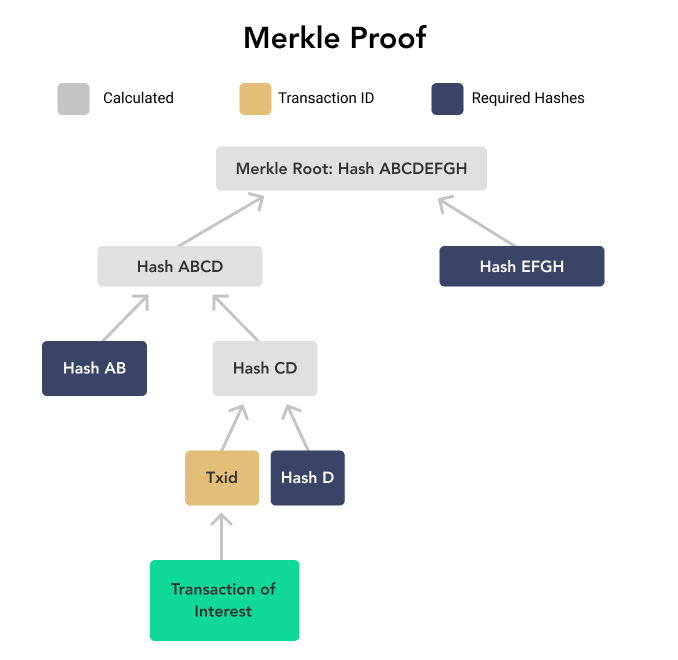

# Final Cheat Sheet — CSE508

Confidentiality - Data is only accessible to authorized parties
Integrity - Data has not been tampered with or corrupted during transit
Anonymity - Hide the identity of the participants of the communication

---

## Diffie‑Hellman
 - DLP (Discrete Logarithm Problem): given $g^a$, find $a$.
 - CDH (Computational Diffie‑Hellman): given $g^a$ and $g^b$, compute $g^{ab}$.
 - DDH (Decisional Diffie‑Hellman): given $g^a, g^b$ and a value $Z$, decide whether $Z=g^{ab}$ or $Z$ is random.

---

## One‑Time Pad (OTP)
- Encrypt: ciphertext = plaintext XOR key (key length = message length).
- Perfect secrecy if: key is truly random, used only once, and kept secret.
- Danger: key reuse — XOR of two ciphertexts cancels the key and leaks information.

---

## RSA
1. Key Generation
  - Select 2 primes p and q
  - n = p * q
  - select d,e such that $x^(de) % n=x$
  - public key <e,n>
  - private key <d,n>
2. Encrypt using public key
  - $c = m^e % n $
3. decrypt with private key
  - $ m = c^d % n $
  - RSA will be broken with Quantum Computing
  - RSA is deterministic, so it fails INDCPA
    - Repeat of M gets the exact same C

---

## AES Modes
 - **AES-ECB — Electronic Code Book**: Encrypts each 128-bit block independently (Ci = E_K(Pi)). Deterministic (same plaintext → same ciphertext), so it leaks patterns; avoid for multi-block data.

- **AES-CBC — Cipher Block Chaining**: Uses a fresh random IV; encryption Ci = E_K(Mi ⊕ Ci-1), decryption Mi = Ci-1 ⊕ D_K(Ci). Provides chaining but needs integrity (MAC/AEAD) and correct IV handling to be secure.

- **AES-CTR — Counter Mode**: Turns block cipher into a stream cipher using EK(IV + i); Ci = Mi ⊕ EK(IV+i). Allows random access and efficient parallelism; nonce/IV must never repeat for a key.

- **AES-GCM/CCM (AEAD) — Authenticated Encryption**: GCM (Galois/Counter) and CCM combine CTR-like encryption with an authentication tag (AEAD). Provide confidentiality + integrity in one primitive and are the recommended modes (used in TLS).

> Use authenticated encryption (AEAD) whenever possible (e.g., GCM, ChaCha20‑Poly1305).

---

## Merkle Tree (construction)
1. Hash each data block to produce leaves: $H_1, H_2, \ldots$.
2. Pair neighboring leaves, concatenate pairs, and hash pairs to form parent nodes: e.g. $H_{12} = H( H_1 \| H_2 )$
3. Repeat upward until a single root hash remains — the Merkle root.

---

## Common Weaknesses
| Weakness | Typical attack | Mitigation |
|---|---|---|
| Static keys | Retrospective decryption | Use ephemeral keys (Perfect Forward Secrecy) |
| No randoms | Replay attacks | Use nonces, sequence numbers, timestamps |
| Weak hashing | Collision attacks | Use SHA‑256 or stronger |
| Plaintext handshake | Eavesdropping | Encrypt handshake (modern TLS) |

---

## Information Flow & Side‑Channels
- Information Flow (MLS concepts): reason about how data labeled `High` (secret) may influence `Low` (public) outputs; properties: noninterference (no flow from High→Low) and non‑deducibility (observer cannot eliminate high inputs).
- Covert channels: unintended channels (timing, resource usage, stdout) that leak high data through low-observable behavior; examples: timing delays, process scheduling, file system metadata.
- Side‑channel attacks: timing, cache, power, electromagnetic analysis; attackers exploit observable differences in implementations to recover secrets.
- Defenses: constant‑time implementations, noise/padding, reduce observable state, limit precision of timers, blinding (RSA), algorithmic changes and rate‑limiting of error messages.

## CBC Padding Oracle (Vaudenay / Lucky13)
- Background: PKCS#7 padding adds p bytes each with value p; invalid padding triggers errors that may be observable to an attacker.
- Vaudenay padding oracle: adaptive chosen‑ciphertext attack that uses padding validity responses to decrypt CBC ciphertexts without the key by manipulating ciphertext blocks.
- Lucky13 (TLS/DTLS): timing side‑channel from MAC+padding processing that leaks information about padding length; exploits subtle timing differences in record processing.
- Mitigations: use AEAD modes (GCM/CCM) or encrypt‑then‑MAC constructions; ensure indistinguishable error handling (uniform error messages and constant‑time processing); avoid returning padding validity to callers; apply strict record parsing and constant‑time MAC checks.

## Privacy, Anonymity & Tor
- Privacy vs Anonymity: privacy controls collection/use of PII; anonymity prevents linking actions to identities (unlinkability). Pseudonymity provides persistent but unlinkable identifiers.
- Threat models: local observers (ISP), on‑path adversaries, endpoint collusion, global passive observers; always assume some intermediaries may be adversarial — TLS alone does not solve traffic analysis.
- Fingerprinting & traffic analysis: browser/device fingerprinting (canvas, WebGL, fonts, AudioContext, battery), and website fingerprinting (packet sizes/timing) can deanonymize users even over encrypted channels.
- Anonymity sets & mixnets: larger anonymity sets increase unlinkability; mixers (mixnets) add batching and reordering to defeat timing correlation at the cost of latency and throughput.
- Tor highlights: onion routing with entry guards, middle relays, exit nodes; client builds layered encryption (three-hop circuits), resists single-relay compromise but is vulnerable to global passive adversaries and website fingerprinting.
- Hidden services: use introduction points, rendezvous points, and service descriptors (DHT) to publish and connect without exposing IPs; operational care needed to avoid deanonymizing metadata.
- Defenses/operational tips: reduce fingerprinting surface (resist JS fingerprinting, use Tor Browser), prefer high‑latency mixnets for strong anonymity when acceptable, pad and shape traffic (where feasible), monitor ingress/egress correlation risks, use entry guards and avoid reusing circuits for sensitive links.

## DNS Protocol Recap

- Flow: stub resolver → recursive resolver → root → TLD → authoritative server; resolver caches and returns the answer.
- Transport: UDP/53 (default, fast) ; TCP/53 (truncation, large responses, AXFR) ; DoT/DoH for encrypted queries.
- Key fields & RRs (very quick): 16‑bit TXID; flags (QR, TC, RD, RA); counts (QD/AN/NS/AR); common RRs: A, AAAA, NS, CNAME, MX, PTR, TXT, SOA.
- Caching/TTL: answers cached for TTL seconds; negative caching via SOA; TTL controls propagation/staleness window.
- Important extensions: EDNS(0) (larger UDP payloads), DNS Cookies, QNAME minimization.
- Attacks & short mitigations: cache poisoning → TXID+source‑port randomization + DNSSEC; amplification → close/harden open resolvers + rate‑limit; on‑path tampering → DoT/DoH.
- Ops notes: TC→retry over TCP; restrict/authenticate AXFR (TSIG); avoid open recursive resolvers.

### DNSSEC
- Adds digital signatures to DNS records and a chain of trust (root → TLD → authoritative).
- Provides integrity and authentication, but not privacy (DNSSEC responses are still visible unless combined with DoT/DoH).
 
### CDN (Content Delivery Network) & DNS
- CDNs use DNS (geo‑DNS / EDNS client subnet) or HTTP redirects to point clients to a nearby PoP (edge server) IP.
- Flow: resolver → authoritative CDN DNS → returns IP for best PoP (may use client IP or ECS); TTLs are kept short for agility.
- Benefits: caches content closer to users, reduces origin load, improves latency, and absorbs volumetric DDoS traffic at edges.
- Risks: DNS compromise or cache poisoning can redirect users; low TTLs increase DNS query load; EDNS client subnet leaks partial client location to CDNs.
- Mitigations: protect authoritative DNS (DNSSEC, Anycast, rate‑limit), use CDN security features (WAF, DDoS mitigation), monitor edge health and origin failover.

---

## SSL/TLS
- Purpose: provides encryption (confidentiality), integrity, and server/client authentication for application protocols (e.g., HTTPS, IMAPS).
- TLS 1.3 (modern) handshake, high level:
  - ClientHello (versions, cipher suites, key_share, SNI, PSK offers) → ServerHello (chosen suite, server key_share).
  - Encrypted handshake: EncryptedExtensions, Certificate, CertificateVerify, Finished — most handshake data after ServerHello is encrypted.
  - Key exchange: ECDHE (ephemeral) for forward secrecy; symmetric keys derived with HKDF.
  - Record layer: AEAD ciphers (e.g., AES-GCM, ChaCha20-Poly1305) provide combined auth+enc.
- Key features: authenticated encryption (AEAD), ephemeral key exchange (ECDHE), session resumption via PSK/tickets, optional 0-RTT early data (replay risks).
- Certificate validation: verify chain, check CN/SAN, validity window, revocation methods (OCSP/CRL/OCSP stapling); TLS session resumption relies on ticket/PSK trust.
- Operational notes: prefer TLS 1.3; disable legacy cipher suites and renegotiation; enable OCSP stapling and short-lived certs where possible.

### TLS 1.3 Protocol Exchange (1‑RTT overview)
1. **ClientHello** — client sends supported cipher suites and a KeyShare (e.g., ECDHE public key share).
2. **ServerHello & Response** — server replies with selected cipher suite, server KeyShare; sends encrypted extensions and Certificate; includes Finished MAC to prove handshake integrity.
3. **Client Finished** — client verifies server Certificate and Finished; sends its own Finished message.

- TLS 1.3 reduces round trips by sending key shares early; handshake keys derive from ECDHE and certificates.

### TLS — Common vulnerabilities & pitfalls
- Certificate issues: misissued or compromised CAs, improper chain/hostname/expiry checks, and unreliable revocation handling (CRL/OCSP).
- Protocol downgrade & legacy ciphers: fallback to weak suites enables downgrade attacks.
- Handshake/implementation bugs: e.g., Early CCS and similar flaws that allow weak keying or transcript manipulation.
- 0-RTT replay risks: TLS 1.3 early data may be replayed unless mitigated at the application layer.
- RNG & key management: poor randomness, nonce reuse, and long-lived keys (no PFS) weaken security.
- Side-channel and memory bugs: timing/oracle attacks, Heartbleed-style memory leaks, and other implementation defects.
 - Side-channel and memory bugs: timing/oracle attacks, Heartbleed-style memory leaks, and other implementation defects.

## FTP (File Transfer Protocol)
- Plaintext protocol: control channel (TCP/21) sends commands and credentials in cleartext by default.
- Active vs Passive modes:
  - Active (PORT): client opens ephemeral port, tells server to connect back → NAT/firewall issues because server connects to client.
  - Passive (PASV): server opens ephemeral data port, client connects → better for clients behind NAT.
- Security: use `FTPS` (FTP over TLS) or `SFTP` (SSH File Transfer, different protocol) instead of plain FTP.
- Common mitigations: disable anonymous access, require strong auth, limit and firewall data port ranges (and document them), prefer SFTP/FTPS, log transfers, chroot or restrict user directories.

---

## Certificate Transparency (CT) & ACME
- Certificate Transparency: public, append-only logs of issued certificates. CAs submit certs to CT logs and return Signed Certificate Timestamps (SCTs).
  - CT is a bulletin Board for what CA issued what certificate. needs to be confirmable. its a deterrent to stop bad CA's 
  - initially get a Signed Certificat Timestamp with max merge of 24 hrs.
  - inclusion proof: 
  - checks if your cert is inside the merkel tree
  - SCTs are embedded in certificates or stapled by servers; monitors/auditors watch logs to detect misissuance.
  - CT helps detect rogue or misissued certificates quickly by providing public visibility.
- ACME (Automated Certificate Management Environment): protocol (used by Let's Encrypt) for automated issuance/renewal of certificates.
  - ACME uses challenges (HTTP-01, DNS-01, TLS-ALPN-01) to prove domain control and an account key for the requester.
  - ACME + short-lived certs encourage automation and reduce manual CA processes.
  - ACME - Lets Encrypt is automated way to provide free certs. But each cert is a short time. needs to validate that you control the server and domain if you want a cert. no *.domain.com certs
- Overall ACME Protocol Flow
  1. Client generates an account key pair and registers with the ACME server
  2. Client submits an order for a domain (e.g. example.com)
  3. Server responds with an authorization object containing challenge options
  4. Client fulfils a challenge (HTTP -01 or DNS -01) and signals readiness
  5. Server verifies the challenge — authorization marked valid
  6. Client submits a CSR signed with the domain key; server issues the certificate

### ACME Challenge Comparison (HTTP vs DNS)
| Challenge | Pros | Cons |
| :--- | :--- | :--- |
| **HTTP-01** | Easy to automate; doesn't require DNS API access; works on standard port 80. | **No wildcard support**; requires web server to be reachable on port 80; firewall must allow inbound traffic. |
| **DNS-01** | **Supports Wildcard certificates**; works for internal/private servers; no inbound port 80/443 required. | Requires automated API access to DNS provider (security risk); DNS propagation delays; complex setup. |

---

## Denial-of-Service (DoS)
- Goal: deny or degrade availability. Often distributed (DDoS); can exhaust bandwidth, CPU, memory, sockets, or human attention.

- Categories:
  - Volumetric / Amplification: spoofed small requests cause much larger replies (Smurf, DNS/NTP/CLDAP/SSDP).
  - Transport/state exhaustion: SYN flooding (half‑open connections), TCP RST injection to kill sessions.
  - Application‑layer: connection flooding, Slowloris, HTTP/2 Rapid Reset, and algorithmic complexity attacks.

- Short mitigations:
  - Network: upstream filtering, ingress/egress filtering (uRPF), Anycast/CDN, blackholing and capacity planning.
  - Transport: SYN cookies, drop old half‑opens, connection limits, TCP timeouts, rate limiting.
  - Application: WAFs, request rate‑limits, resource quotas, fix algorithmic worst-cases (input validation, safer parsers).
  - Amplification-specific: disable/respond-to-broadcasts, restrict/harden open UDP services, close open resolvers, apply rate limits.

- Extra notes: Smurf (broadcast amplification), SYN cookies (state‑less SYN defense), Slowloris (hold connections open), HTTP/2 Rapid Reset (stream-reset abuse).

### Smurf Attacks
- Mechanism: attacker spoofs victim IP as source and sends ICMP Echo requests to a broadcast address; many hosts reply to the victim causing amplification.
- Requirements: networks that respond to directed/broadcast pings and lack ingress filtering for spoofed IPs.
- Mitigations: disable IP‑directed broadcasts on routers, configure hosts to ignore broadcast ICMP, apply ingress filtering/uRPF to block spoofed source IPs, and block/ratelimit ICMP from untrusted sources.

---

## Firewalls & Tunnels
 - Firewalls:
   - Types: stateless (ACLs), stateful (tracks sessions), NGFW (L7 inspection).
   - Rule order (quick): `allow RELATED,ESTABLISHED` → allow required services → `default-deny`.
   - Placement: edge chokepoint + internal segmentation (VLAN/DMZ).
  - Pitfalls: open management ports, UPnP/auto-port-mapping, misordered rules, broad CIDRs.
  - UPnP (auto port‑mapping) — brief: allows LAN apps to request NAT/firewall port openings dynamically (automatic port forwarding).
    - Why it's a flaw: typically unauthenticated and enabled by default on consumer gateways so malware or malicious apps can open WAN‑accessible ports, exposing internal services.
    - Mitigations: disable UPnP on edge devices unless necessary, use explicit/manual port forwarding, restrict UPnP to trusted LAN interfaces, keep firmware patched, and monitor/clear dynamic mappings; block IGD/UPnP traffic on the WAN side.
   - each rule is priority top to bottom:
    - <sourceIP, sourcePort, destinationIP, destinationPort, condition, protocol, decision>
    - <localhost, *, X, 22, *, SSH/TCP, allow> - allow outgoing ssh connections
    - <*, *, *, *, true, *, deny> - default-deny rule outline
- Tunnels / VPNs:
  - Use SSH Tunneling to bypass a restrictive firewall by allowing tcp forwarding and port translating to allow web surfing from the server's visibility
  - IPSec (site-to-site, transport vs tunnel mode), OpenVPN/TLS-based VPNs, WireGuard (modern, simple, fast), SSH tunnels.
  - Use strong auth (certificates or strong PSKs), encrypt both control and data planes, and enable perfect forward secrecy where possible.
  - NAT traversal: NAT-T for IPsec, UDP encapsulation, STUN/TURN for P2P apps.

### Zero Trust (brief)
- Principle: "Never trust, always verify" — authenticate & authorize every access request regardless of network location.
- Key controls: identity & device posture checks, least privilege, microsegmentation (per‑service policies), continuous logging/telemetry and conditional access policies.
- Why use it: reduces lateral movement and blast radius compared with flat trust models; enforce via IAM, device management, service mesh, or policy engines.

### L2 vs L3 boundaries (network segmentation)
- L2 (layer 2): switches, MAC forwarding, VLANs — good for local segmentation but susceptible to ARP spoofing, CAM table floods, and broadcast storms; use port‑security and DAI at access layer.
- L3 (layer 3): routers/firewalls, IP routing and ACLs — enforces routing boundaries and IP‑level filtering, reduces broadcast domains and offers clearer policy enforcement for inter‑VLAN traffic.
- Design note: combine both — use L2 isolation (VLANs) at access, enforce inter‑VLAN policies at L3 (firewall/router), and apply microsegmentation for sensitive workloads.

### SSH Tunneling — what it is and how it bypasses firewalls
- What it is: SSH tunneling uses an authenticated, encrypted SSH connection as a generic transport to carry other TCP connections or proxy traffic through a permitted channel. The SSH connection acts as an encrypted pipe between the client and an SSH server (often a bastion or jump host).
- How it bypasses firewalls: many networks allow outbound SSH (or another allowed port) to reach an internal/edge host. By encapsulating application traffic inside the SSH session, clients can send and receive data to/through the SSH server even when direct connections are blocked by firewall rules. The SSH server then forwards the encapsulated traffic to the final destination from its network perspective, so the firewall only sees an allowed SSH session rather than the blocked application-level flows.
- Common uses (conceptually): local forwarding (forward a remote service to a local port), remote forwarding (expose a local service via the server's network), and dynamic proxying (tunnel multiple connections through the SSH channel). These are types of forwarding behavior rather than new protocols.
- Security implications: the SSH endpoint becomes an exit point — outgoing traffic from the server's network may be visible to that host, and misuse can expose internal services. Authentication should be strong (keys, not passwords), server-side restrictions should be applied (limit permitted forwards and bind addresses), and monitoring/logging of forwarded connections is recommended.

---

## BGP (Border Gateway Protocol)
- Purpose: inter-domain routing between Autonomous Systems (ASes). BGP runs over TCP port 179 and exchanges route announcements (prefixes + attributes).
- Core message types: OPEN, UPDATE (announcements/withdrawals), KEEPALIVE, NOTIFICATION.
- Route selection (simplified): highest local-pref → shortest AS_PATH → lowest origin type → lowest MED → eBGP over iBGP → lowest IGP cost to next-hop.
- Common issues: route hijacks (malicious or accidental announcements), prefix leaks, AS path manipulation.
- Mitigations: prefix filtering and route-policy, max-prefix limits, IRR-based filtering, RPKI/ROA origin validation (detect bogus origin AS), monitoring (BGPmon), and strict peering policies.

### eBGP vs iBGP
- eBGP (external BGP): runs between different Autonomous Systems (ASes). Peers are typically directly connected; eBGP updates normally modify the `AS_PATH` (prepend local AS) and are used to advertise reachability to the global Internet.
- iBGP (internal BGP): runs within a single AS. iBGP preserves `AS_PATH` (does not prepend) and peers may be multiple hops away; routes learned from one iBGP peer are not re-advertised to another iBGP peer (split-horizon), so a full mesh or route reflectors are required for scalability.
- Operational notes: eBGP sessions often assume adjacent peers and may use TTL/adjacency checks; iBGP requires careful topology (full mesh, route reflectors, or confederations) to ensure route propagation and avoid loops.

### BGP — Security risks
- Prefix hijacking: an AS advertises IP prefixes it does not own (maliciously or by misconfiguration), causing traffic to be diverted or dropped.
- Route leaks: an AS improperly advertises routes learned from one peer to others, exposing prefixes to unintended paths and disrupting routing.
- Path manipulation & AS_PATH spoofing: altering `AS_PATH` or prepending to influence route selection and route acceptance.
- Lack of authentication: classic BGP has no cryptographic origin/path validation, enabling impersonation and false announcements.
- Session attacks: TCP-level attacks (RST injection, session hijacking) or compromised peers can inject malicious UPDATEs.
- Instability & amplification: frequent bogus announcements/withdrawals (flapping) can create routing instability and large control-plane loads.
- RPKI/ROA risks & operational pitfalls: incomplete deployment, misconfigured ROAs, and reliance on a centralized trust infrastructure can cause accidental outages or false validation failures.
- Impact: traffic interception (MitM), blackholing, censorship, interception for data exfiltration or DDoS amplification via misdirected traffic.
-- lower content amount

**Brief mitigations:** strict prefix filtering, IRR/RPKI origin validation, max-prefix and sanity checks, neighbor authentication/ACLs, TTL/adjacency protections, monitoring and rapid remediation (BGPmon, route collectors).

---

## MAC vs Digital Signature
| Feature | MAC | Digital Signature |
|---|---:|---:|
| Key type | Symmetric (shared secret) | Asymmetric (public/private pair) |
| Speed | Very fast | Slower (public-key ops) |
| Non-repudiation | No | Yes |
| Primary use | Packet/message integrity | Legal docs, code signing, non‑repudiation |

---

## Short Practical Notes
- Depth of crypto security often relies on proper randomness and forward secrecy.
- Prefer ephemeral (per-session) keying for confidentiality forward secrecy.
- For network security QA: know tradeoffs (speed vs non‑repudiation), and when to use AEAD vs separate MAC+enc schemes.

---
## Lecture extras
- ARP poisoning / spoofing: inject fake ARP replies to poison host caches (enables MITM); defend with static bindings, Dynamic ARP Inspection (DAI) and monitoring.
- DHCP exhaustion / rogue DHCP: consume IP pool or run fake servers to disrupt clients; mitigate with DHCP snooping, trusted switch ports and rate limits.
- MAC/CAM table flooding: flood switches with fake MACs to overflow the CAM table and force fail‑open behavior; use port security and MAC limits.
- Wi‑Fi deauth & evil‑twin: send spoofed deauth frames or run rogue APs to disconnect or capture clients; mitigate with 802.11w (MFP), WPA2/3 and strong AP authentication.
- "Evil packet" exploits (Ping‑of‑Death, LAND, Teardrop): crafted packets that trigger kernel/stack bugs and crashes; defend by patching, ingress filtering, and fragmentation checks.
- Operational defenses (lecture): enable DHCP snooping/DAI on switches, disable IP‑directed broadcasts (Smurf mitigation), restrict open resolvers and close unnecessary UDP services.

---
## Public Key Infrastructure (PKI)
- Purpose: bind public keys to identities using certificates (X.509). CAs issue and sign certs; trust is anchored in root CA public keys.
- CA hierarchy: Root CA (trust anchor) → Intermediate CA(s) → End‑entity certs; validation builds a chain to a trusted root.
- Certificate essentials: Subject, SubjectAltName (SAN), Issuer, Validity (notBefore/notAfter), Public Key, Signature, Extensions (keyUsage, EKU, basicConstraints, CRL/OCSP endpoints).
- Issuance flow: generate keypair + CSR (keep private key secret) → CA verifies identity → CA issues cert. Protect CA/keys (HSMs, secure ops).
- Revocation & checking: CRLs (pull), OCSP (real‑time), OCSP stapling (server‑provided proof) — clients must check expiry and revocation where required.
- Validation checklist: chain signature verification, expiry, CN/SAN name match, keyUsage/EKU policy, and revocation status.
- Threats & mitigations: misissued or compromised CA → use Certificate Transparency (CT) logs, short‑lived certs, strict auditing, key protection (HSM), and rapid revocation/patching.
- Ops note: automate issuance (ACME) + short lifetimes; enable OCSP stapling and monitor CT and revocation telemetry.

