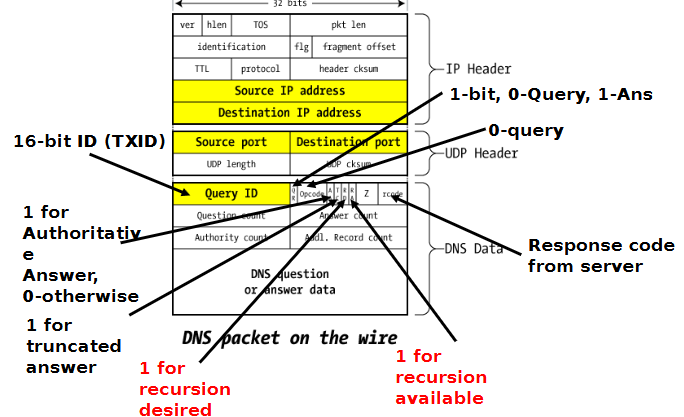

# Midterm 2 Cheat Sheet — CSE508

A compact reference for core concepts likely to appear on the midterm.

---

## Diffie‑Hellman
 - DLP (Discrete Logarithm Problem): given $g^a$, find $a$.
 - CDH (Computational Diffie‑Hellman): given $g^a$ and $g^b$, compute $g^{ab}$.
 - DDH (Decisional Diffie‑Hellman): given $g^a, g^b$ and a value $Z$, decide whether $Z=g^{ab}$ or $Z$ is random.

> Notes: problems are defined over a chosen cyclic group (e.g., $\mathbb{Z}_p^*$ or elliptic-curve groups).

---

## One‑Time Pad (OTP)
- Encrypt: ciphertext = plaintext XOR key (key length = message length).
- Perfect secrecy if: key is truly random, used only once, and kept secret.
- Danger: key reuse — XOR of two ciphertexts cancels the key and leaks information.

---

## AES Modes (quick)
- **AES‑ECB**: encrypts each block independently. Leaks plaintext patterns (do not use for structured data).
- **AES‑CBC**: provides confidentiality (chain blocks), but no built‑in integrity/authentication.
- **AES‑CTR**: turns block cipher into stream cipher (keystream XOR plaintext); no authenticity.
- **AES‑GCM**: AEAD mode — provides both confidentiality and integrity (recommended when available).

> Use authenticated encryption (AEAD) whenever possible (e.g., GCM, ChaCha20‑Poly1305).

---

## TLS 1.3 Protocol Exchange (1‑RTT overview)
1. **ClientHello** — client sends supported cipher suites and a KeyShare (e.g., ECDHE public key share).
2. **ServerHello & Response** — server replies with selected cipher suite, server KeyShare; sends encrypted extensions and Certificate; includes Finished MAC to prove handshake integrity.
3. **Client Finished** — client verifies server Certificate and Finished; sends its own Finished message.

- TLS 1.3 reduces round trips by sending key shares early; handshake keys derive from ECDHE and certificates.

---

## Merkle Tree (construction)
1. Hash each data block to produce leaves: $H_1, H_2, \ldots$.
2. Pair neighboring leaves, concatenate pairs, and hash pairs to form parent nodes: e.g. $H_{12} = H( H_1 \| H_2 )$.
3. Repeat upward until a single root hash remains — the Merkle root.

---

## Common Weaknesses — quick mapping
| Weakness | Typical attack | Mitigation |
|---|---|---|
| Static keys | Retrospective decryption | Use ephemeral keys (PFS) |
| No randoms | Replay attacks | Use nonces, sequence numbers, timestamps |
| Weak hashing | Collision attacks | Use SHA‑256 or stronger |
| Plaintext handshake | Eavesdropping | Encrypt handshake (modern TLS) |

---

## DNS Protocol Recap
 - Lookup flow: stub resolver (client) → recursive resolver (ISP or public resolver) which performs iterative queries starting at the root → TLD → authoritative name server; the resolver caches the answer and returns it to the client.

 - Typical transports and ports:
   - UDP/53: standard queries/responses (fast, connectionless).
   - TCP/53: zone transfers (AXFR/IXFR), large/truncated responses, and DNS-over-TLS (DoT).

 - Key header fields (DNS message format):
   - 16-bit Transaction ID (TXID)
   - Flags: QR (query/response), Opcode, AA (authoritative answer), TC (truncation), RD (recursion desired), RA (recursion available), RCODE (response code)
   - Counts: QDCOUNT, ANCOUNT, NSCOUNT, ARCOUNT

 - Common query / resource record (RR) types: `A`, `AAAA`, `NS`, `CNAME`, `MX`, `PTR`, `TXT`, `SRV`, `SOA`, `AXFR`.

 - Resolution modes:
   - Recursive: the resolver does the full lookup and returns a final answer to the client.
   - Iterative/referral: a server returns a referral to the next-level name servers; the resolver follows the referral.

 - Caching & TTL:
   - Responses are cached by resolvers for the record's TTL seconds.
   - Negative caching (NXDOMAIN) is controlled by SOA/minimum values.
   - TTLs determine propagation time for updates and the window for stale data.

 - Extensions & modern features:
   - EDNS(0): allows larger UDP payloads and additional options (bigger responses, EDNS flags).
   - DNS over TLS (DoT) and DNS over HTTPS (DoH): encrypt DNS for privacy and tamper-resistance.
   - DNS Cookies, Query Name Minimization: reduce abuse and improve privacy/security.

 - Common attacks & mitigations:
   - Cache poisoning: mitigate with TXID + source-port randomization and DNSSEC validation.
   - Amplification/reflection: mitigate by restricting open resolvers and rate-limiting.
   - On-path tampering / eavesdropping: mitigate with DoT/DoH and DNSSEC.

 - Operational notes:
   - Truncation (TC bit): when UDP response exceeds negotiated size, server sets TC; client retries over TCP.
   - Zone transfers (AXFR) should be restricted and authenticated (e.g., TSIG).

 **Diagram:**

 

### DNSSEC
- Adds digital signatures to DNS records and a chain of trust (root → TLD → authoritative).
- Provides integrity and authentication, but not privacy (DNSSEC responses are still visible unless combined with DoT/DoH).

---

## SSL/TLS
- Purpose: provides encryption (confidentiality), integrity, and server/client authentication for application protocols (e.g., HTTPS, IMAPS).
- TLS 1.3 (modern) handshake, high level:
  - ClientHello (versions, cipher suites, key_share, SNI, PSK offers) → ServerHello (chosen suite, server key_share).
  - Encrypted handshake: EncryptedExtensions, Certificate, CertificateVerify, Finished — most handshake data after ServerHello is encrypted.
  - Key exchange: ECDHE (ephemeral) for forward secrecy; symmetric keys derived with HKDF.
  - Record layer: AEAD ciphers (e.g., AES-GCM, ChaCha20-Poly1305) provide combined auth+enc.
- Key features: authenticated encryption (AEAD), ephemeral key exchange (ECDHE), session resumption via PSK/tickets, optional 0-RTT early data (replay risks).
- Certificate validation: verify chain, check CN/SAN, validity window, revocation methods (OCSP/CRL/OCSP stapling); TLS session resumption relies on ticket/PSK trust.
- Operational notes: prefer TLS 1.3; disable legacy cipher suites and renegotiation; enable OCSP stapling and short-lived certs where possible.

---

## Certificate Transparency (CT) & ACME
- Certificate Transparency: public, append-only logs of issued certificates. CAs submit certs to CT logs and return Signed Certificate Timestamps (SCTs).
  - SCTs are embedded in certificates or stapled by servers; monitors/auditors watch logs to detect misissuance.
  - CT helps detect rogue or misissued certificates quickly by providing public visibility.
- ACME (Automated Certificate Management Environment): protocol (used by Let's Encrypt) for automated issuance/renewal of certificates.
  - ACME uses challenges (HTTP-01, DNS-01, TLS-ALPN-01) to prove domain control and an account key for the requester.
  - ACME + short-lived certs encourage automation and reduce manual CA processes.

---

## Denial-of-Service (DoS) attacks
- Categories:
  - Volumetric: saturate bandwidth (e.g., UDP amplification via DNS/NTP/CLDAP/SSDP).
  - Protocol/state exhaustion: SYN floods, TCP connection table exhaustion.
  - Application-layer: HTTP GET/POST floods, slowloris (keep connections open), targeted resource exhaustion.
- Typical mitigations:
  - Network-level: upstream filtering, source-IP validation (uRPF), blackholing, Anycast and CDNs, capacity overprovisioning.
  - Transport-level: SYN cookies, connection limits, TCP timeouts, rate limiting.
  - Application-level: WAFs, request rate-limiting, challenge-response (CAPTCHAs), caching and scaling.
  - For amplification: close or harden open resolvers, filter spoofed source IPs, minimize UDP amplification surface.

---

## Firewalls & Tunnels
- Firewalls:
  - Packet-filter (stateless): ACLs based on IP/port.
  - Stateful firewall: tracks connections and applies policies based on state.
  - Application-layer / Next-Gen Firewall (NGFW): inspects L7, provides IDS/IPS, application controls.
  - Best practice: default-deny inbound, restrict outbound as needed, log and monitor.
- Tunnels / VPNs:
  - IPSec (site-to-site, transport vs tunnel mode), OpenVPN/TLS-based VPNs, WireGuard (modern, simple, fast), SSH tunnels.
  - Use strong auth (certificates or strong PSKs), encrypt both control and data planes, and enable perfect forward secrecy where possible.
  - NAT traversal: NAT-T for IPsec, UDP encapsulation, STUN/TURN for P2P apps.

---

## BGP (Border Gateway Protocol)
- Purpose: inter-domain routing between Autonomous Systems (ASes). BGP runs over TCP port 179 and exchanges route announcements (prefixes + attributes).
- Core message types: OPEN, UPDATE (announcements/withdrawals), KEEPALIVE, NOTIFICATION.
- Route selection (simplified): highest local-pref → shortest AS_PATH → lowest origin type → lowest MED → eBGP over iBGP → lowest IGP cost to next-hop.
- Common issues: route hijacks (malicious or accidental announcements), prefix leaks, AS path manipulation.
- Mitigations: prefix filtering and route-policy, max-prefix limits, IRR-based filtering, RPKI/ROA origin validation (detect bogus origin AS), monitoring (BGPmon), and strict peering policies.

---

## MAC vs Digital Signature (comparison)
| Feature | MAC | Digital Signature |
|---|---:|---:|
| Key type | Symmetric (shared secret) | Asymmetric (public/private pair) |
| Speed | Very fast | Slower (public-key ops) |
| Non-repudiation | No | Yes |
| Primary use | Packet/message integrity | Legal docs, code signing, non‑repudiation |

---

## Short Practical Notes
- Depth of crypto security often relies on proper randomness and forward secrecy.
- Prefer ephemeral (per-session) keying for confidentiality forward secrecy.
- For network security QA: know tradeoffs (speed vs non‑repudiation), and when to use AEAD vs separate MAC+enc schemes.

---

